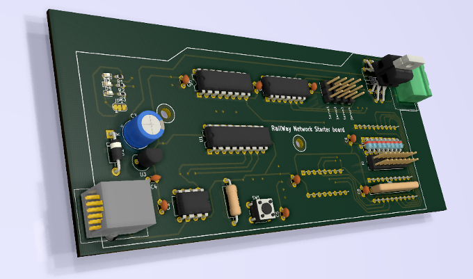
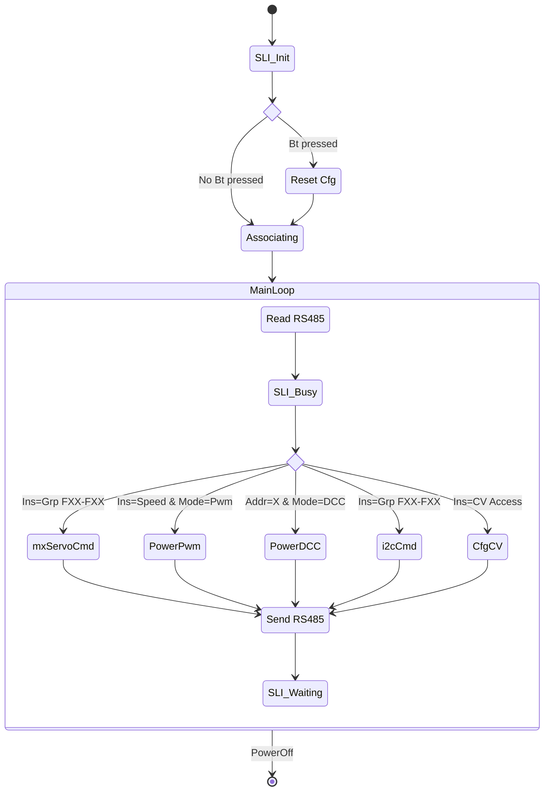

# RailWay Network Starter Board

## Overview

The "RwnStarterBoard" is block module conception board. This repository provide its  firmware 


## Blocks Structure


```mermaid
flowchart TD
	subgraph board
		Chip["PIC16F628A"]
		I2C_io["I2C_io(8xE/S)"]
		MxServoIO["MxServo_io(4x)"]
		Chip -->|"17-18"| SLI
		RS485 <-->|"6-8"| Chip
		Chip -->|"13,15-16"| MxServoIO
		Power -->|"5,14"| Chip
		Chip -->|"10-11"| Track["DCC/PWM"]
		Reset -->|"4"| Chip
		I2C_io <-->|"1-3"|Chip  
		
	end
	classDef .io fill:#24bf58
	classDef .power fill:#d6943a
	class RS485,I2C_io,Reset,SLI .io
	class Power,Track .power
```
## Firmware State Diagram

Below, a theoretical state diagram (not already implemented yet)  


